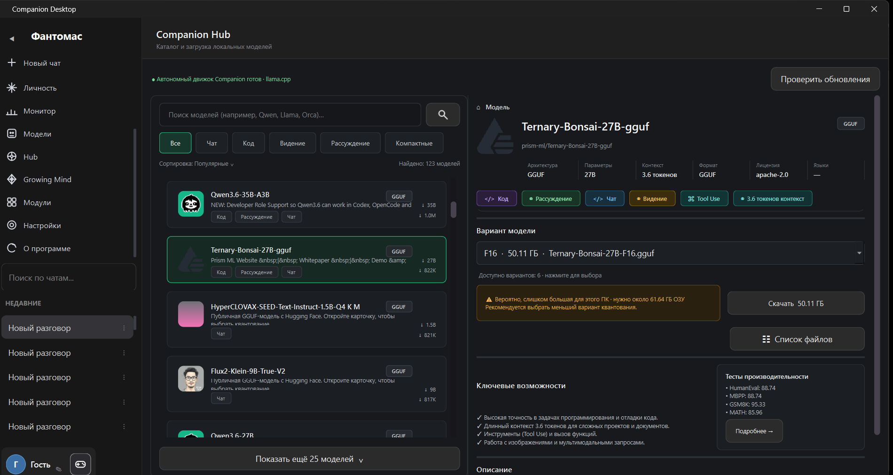
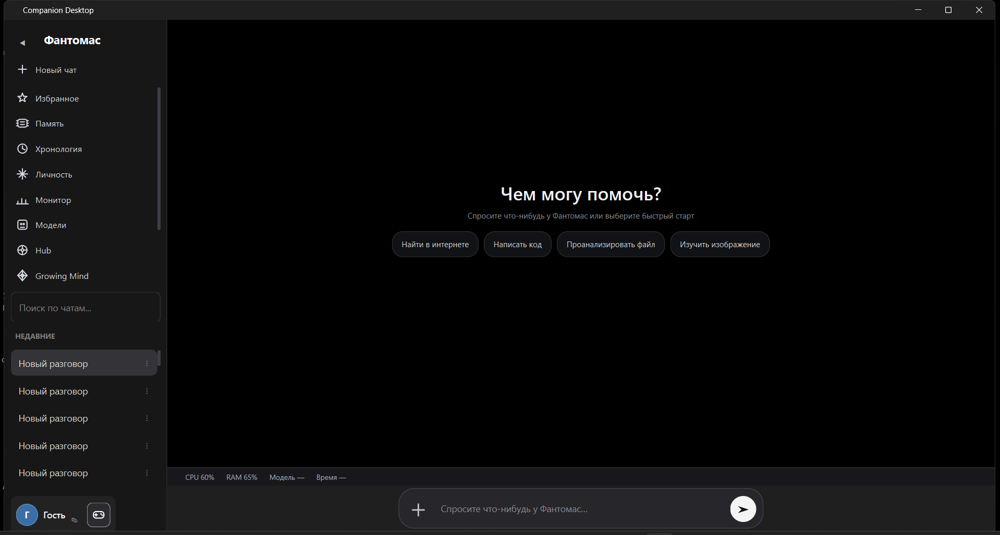

# Companion Desktop

**Персональный ИИ-компаньон для Windows с локальными и облачными моделями**

Companion объединяет общение с ИИ, локальные и облачные модели, долговременную память, интернет-поиск, работу с файлами, кодом и изображениями, а также расширяемую систему модулей в одном настольном приложении.

## Companion Desktop

Современный минималистичный интерфейс с чатами, памятью, личностью, мониторингом, моделями и дополнительными возможностями Companion.

## Companion Hub

Встроенный каталог локальных моделей. Позволяет находить подходящие GGUF-модели, смотреть их характеристики и варианты, оценивать требования к памяти и загружать модели непосредственно из Companion.

## Возможности

- Локальные GGUF-модели через встроенный движок llama.cpp
- Работа локальных моделей без обязательной установки Ollama
- Поддержка облачных моделей ИИ
- Долговременная память и обучение
- Личность Companion
- Использование разных моделей для разных задач
- Поиск и получение информации из интернета
- Работа с файлами и изображениями
- Работа с кодом
- Companion Hub для поиска и загрузки локальных моделей
- Growing Mind
- Устанавливаемые дополнительные модули
- Система обновлений

## Локальный ИИ

Companion может запускать GGUF-модели непосредственно на компьютере пользователя через встроенный движок на базе llama.cpp.

Ollama для работы локальных моделей не требуется.

Подходящие модели можно искать и устанавливать через Companion Hub.

## Локальные и облачные модели

Пользователь может выбрать локальную модель или подключить поддерживаемого облачного провайдера. Это позволяет использовать Companion как полностью локально, так и с более мощными облачными моделями.

## Системные требования

- Windows 10 / Windows 11
- 64-разрядная система
- Требования к оперативной памяти зависят от выбранной локальной модели
- Для облачных моделей и интернет-функций требуется подключение к интернету

## Скачать Companion

### [Открыть Releases и скачать Companion 1.00.5](https://github.com/diinrol-design/Astra-Desktop/releases)

**Windows 10/11 · 64-bit**

Актуальная версия: **Companion 1.00.5**.

## Обновления

Новые версии Companion публикуются в GitHub Releases. В приложении также предусмотрена собственная система проверки обновлений.
